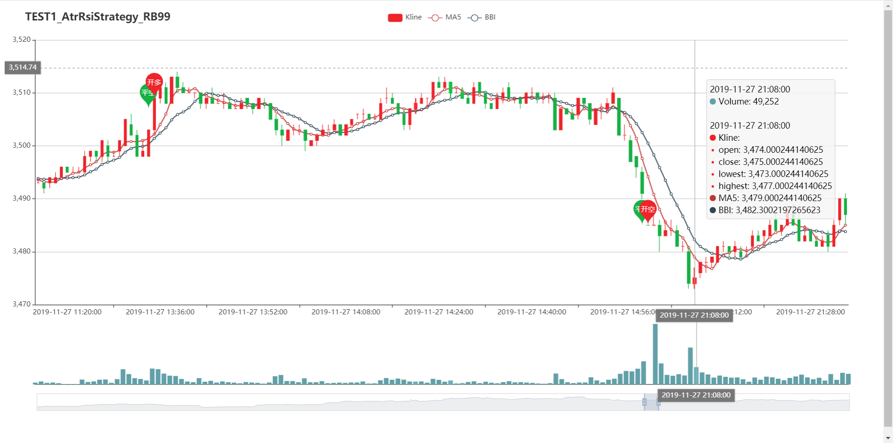
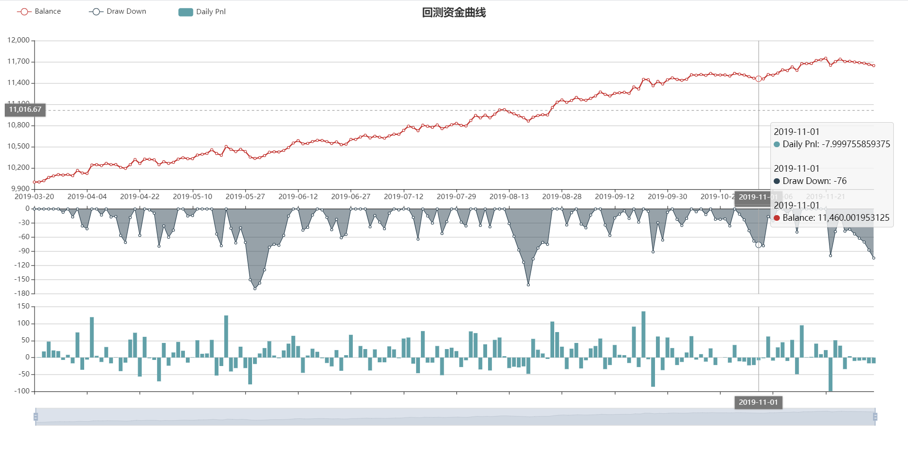

# By Traders, For Traders.
### 基于官方vnpy扩展功能如下（保持兼容官方最新版）
1、[数据源] 增加tdx免费数据源，引用自大佳老师改进版vnpy。[>>传送](https://github.com/msincenselee/vnpy)
``` 
期货模块已兼容到vnpy ui，和官方数据源rqdata使用效果一样。
- 提供主力合约/指数合约的信息获取
- 提供期货/股票数据bar 和分笔成交数据下载
- 提供每日增量更新期货数据=> csv文件
```
2、[回测] 扩展回测功能，可选保存每次回测结果。
``` 
- 保存回测过程数据到csv，包括：
    daily_results.csv(逐日盯市数据)、trades.csv(成交记录)、orders.csv(委托记录)、output.log(日志)
- 资金曲线图可视化：daily_results.html
- 绘制K线图，可视化买卖点，支持自定义指标：KLineChart.html

- 新增csv数据回测
```
3、[策略实盘监控/评估] 保存每个策略实例交易数据，并可视化。
``` 
- 实盘数据trade data捕获和保存到csv：
    daily_results.csv(逐日盯市数据)、trades.csv(成交记录)、orders.csv(委托记录)、output.log(日志)
- 资金曲线图可视化：daily_results.html
- 绘制K线图，可视化买卖点，支持自定义指标：KLineChart.html
- 利用保存的交易数据计算实例评估指标并保存：statistics.json
```
4、[实盘监控] 邮件报表功能，可选盘前/盘后定时推送对应报表。
``` 
- 策略实例运行报表，包括：账号盈亏&持仓情况、策略实例参数&变量列表、当天运行日志。
- 策略评估报表，主要是第3点中计算的实例评估结果推送。
```
5、[实盘运维] no ui脚本自动化运维。 [no ui使用指南](./vnpy_pro/docs/noui_guide.md)
``` 
- 每次全部策略完成启动后，邮件发送监控报表
- 15:02，保存实例当天trade data，并计算实例评估数据
- 15:05，获取实例评估数据，并邮件发送策略评估报表
- 15:06，更新可视化：资金曲线图daily_results.html、K线图KLineChart.html
```
6、[实盘] 初始化数据
``` 
### 多账户运行
### 实盘初始化
- 强制使用本地数据初始化
### 如何确保本地数据最新？
- 每天实盘开始前，提前下载前5天数据到本地
- 盘中录制数据，防止出现异常，需要重启，而数据源数据更新不及时
```
7、[数据录制]
``` 
- 添加非交易时间过滤
- 添加全市场录制
``` 

### 后续计划
``` 
- 增加renko图
- 异步持久化实盘数据
- 分布式回测？
- trade_data保存方式改为数据库？目前文件形式
- 自动实现移月换仓
- 单独重启某一策略实例
- web服务端使用tornado？
- web可视化展示回测、实盘策略详情
- 实时监控：web实时资金曲线、K线图；
- web端管理策略 ？？？能否实现
```

### 联系方式
有空会接策略开发、代运维、定制开发：

caizhanjin WeChat/phone：18813937194

### 部分图片展示



